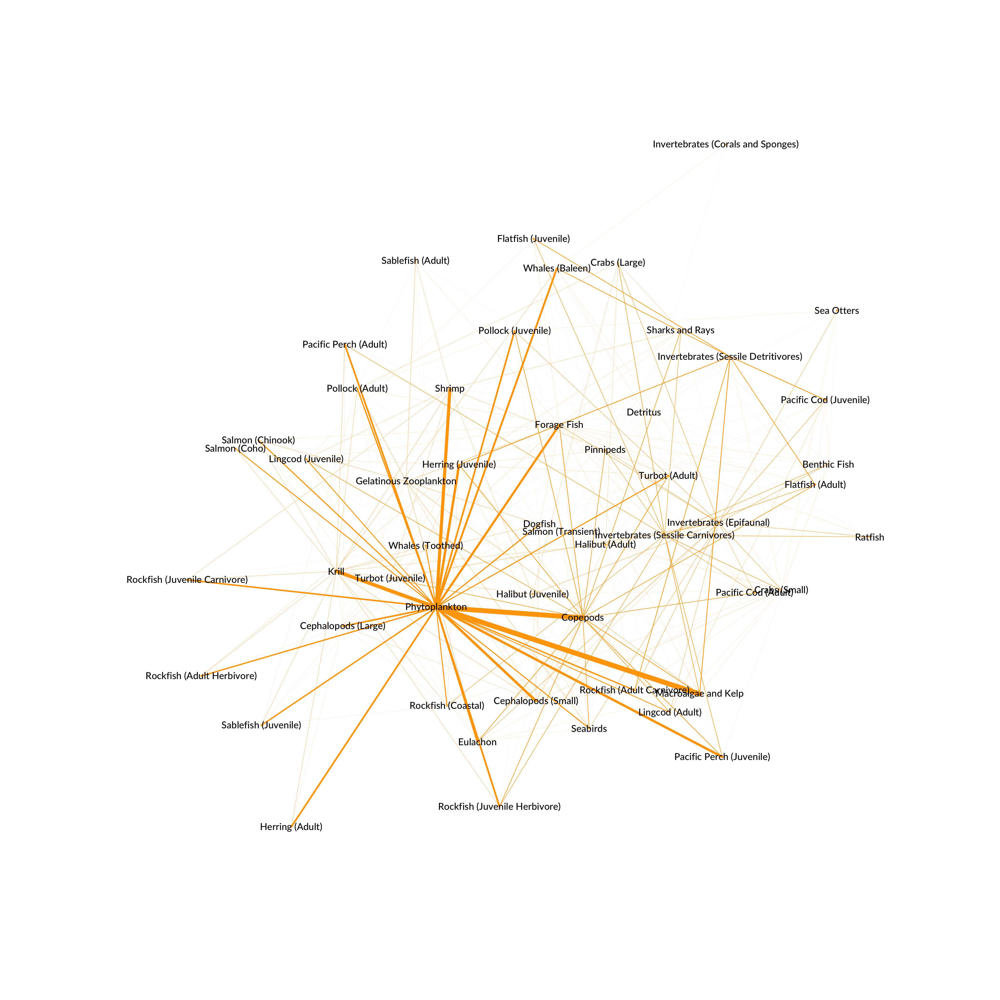
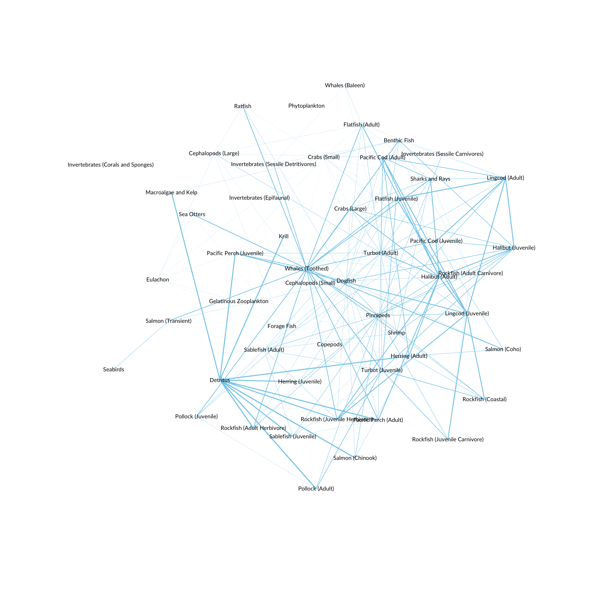

Mapping Trophic Impact
======================

The Northeastern Pacific Ecosystem
----------------------------------

Based on the Ecopath model of the North Pacific by Ainsworth (<DOI:10.1016/j.ecolmodel.2008.05.005>). Networks are made by interconnecting vertices. The .csv data to assign the network nodes. Each node is an ecosystem functional group (e.g. Phytoplankton, Krill, Sharks, Cephalopods, Whales, etc). There are 52 functional groups in this ecosystem model.

To begin, the first step is to load the R packages required to plot the network.

``` r
suppressMessages(library(igraph))
suppressMessages(library(tidyverse))
suppressMessages(library(knitr))
suppressMessages(library(rmarkdown))
```

From the .csv file the `nodes` dataset is created, which has four variables. ID gives the 52 functional groups a unique code that simplyfies network construction. Functional groups can are sorted ascendingly by trophic level.

``` r
nodes <- read.csv("NEPacific_Nodes.csv", header = T, as.is = T)
```

Here is a summary table of the functional groups defined by the `nodes` dataset.

``` r
NorthPacificSummary <- nodes %>%
  rename("ID" = id) %>%
  rename("Functional Groups" = functionalGroup) %>%
  rename("Category" = category) %>%
  rename("Trophic Level" = trophicLevel)
knitr::kable(NorthPacificSummary)
```

| ID  | Functional Groups                    | Category      |  Trophic Level|  Number|
|:----|:-------------------------------------|:--------------|--------------:|-------:|
| A01 | Phytoplankton                        | Producers     |       1.000000|       1|
| A02 | Macroalgae and Kelp                  | Producers     |       1.000000|       2|
| A03 | Invertebrates (Sessile Detritivores) | Invertebrates |       2.000000|       3|
| A04 | Invertebrates (Corals and Sponges)   | Invertebrates |       2.000000|       4|
| A05 | Copepods                             | Invertebrates |       2.000000|       5|
| A06 | Invertebrates (Sessile Carnivores)   | Invertebrates |       2.060000|       6|
| A07 | Invertebrates (Epifaunal)            | Invertebrates |       2.060000|       7|
| A08 | Gelatinous Zooplankton               | Invertebrates |       2.163851|       8|
| A09 | Krill                                | Invertebrates |       2.200000|       9|
| A10 | Shrimp                               | Invertebrates |       2.660000|      10|
| A11 | Crabs (Large)                        | Invertebrates |       2.856894|      11|
| A12 | Pacific Cod (Juvenile)               | Benthic Fish  |       2.919798|      12|
| A13 | Cephalopods (Small)                  | Invertebrates |       2.919913|      13|
| A14 | Herring (Juvenile)                   | Pelagic Fish  |       3.020000|      14|
| A15 | Pacific Perch (Juvenile)             | Pelagic Fish  |       3.040000|      15|
| A16 | Forage Fish                          | Pelagic Fish  |       3.040240|      16|
| A17 | Crabs (Small)                        | Invertebrates |       3.054000|      17|
| A18 | Eulachon                             | Pelagic Fish  |       3.058770|      18|
| A19 | Whales (Baleen)                      | Mammals       |       3.065743|      19|
| A20 | Rockfish (Juvenile Herbivore)        | Benthic Fish  |       3.100000|      20|
| A21 | Salmon (Transient)                   | Pelagic Fish  |       3.115963|      21|
| A22 | Herring (Adult)                      | Pelagic Fish  |       3.180000|      22|
| A23 | Flatfish (Juvenile)                  | Benthic Fish  |       3.159412|      23|
| A24 | Pollock (Juvenile)                   | Pelagic Fish  |       3.184800|      24|
| A25 | Pacific Perch (Adult)                | Pelagic Fish  |       3.204368|      25|
| A26 | Cephalopods (Large)                  | Invertebrates |       3.227478|      26|
| A27 | Flatfish (Adult)                     | Benthic Fish  |       3.263858|      27|
| A28 | Rockfish (Juvenile Carnivore)        | Benthic Fish  |       3.257400|      28|
| A29 | Sablefish (Juvenile)                 | Benthic Fish  |       3.289551|      29|
| A30 | Rockfish (Adult Herbivore)           | Benthic Fish  |       3.479329|      30|
| A31 | Ratfish                              | Benthic Fish  |       3.412058|      31|
| A32 | Rockfish (Adult Carnivore)           | Benthic Fish  |       3.328845|      32|
| A33 | Pollock (Adult)                      | Pelagic Fish  |       3.480898|      33|
| A34 | Benthic Fish                         | Benthic Fish  |       3.610210|      34|
| A35 | Dogfish                              | Benthic Fish  |       3.615890|      35|
| A36 | Sea Otters                           | Mammals       |       3.625503|      36|
| A37 | Salmon (Chinook)                     | Pelagic Fish  |       3.670361|      37|
| A38 | Sablefish (Adult)                    | Benthic Fish  |       3.678421|      38|
| A39 | Turbot (Adult)                       | Benthic Fish  |       3.685540|      39|
| A40 | Sharks and Rays                      | Pelagic Fish  |       3.711499|      40|
| A41 | Seabirds                             | Seabirds      |       3.722580|      41|
| A42 | Rockfish (Coastal)                   | Benthic Fish  |       3.728381|      42|
| A43 | Salmon (Coho)                        | Pelagic Fish  |       3.754261|      43|
| A44 | Pinnipeds                            | Mammals       |       3.773137|      44|
| A45 | Halibut (Juvenile)                   | Benthic Fish  |       3.818166|      45|
| A46 | Turbot (Juvenile)                    | Benthic Fish  |       3.898125|      46|
| A47 | Pacific Cod (Adult)                  | Pelagic Fish  |       3.906217|      47|
| A48 | Whales (Toothed)                     | Mammals       |       3.995140|      48|
| A49 | Halibut (Adult)                      | Benthic Fish  |       4.003436|      49|
| A50 | Lingcod (Juvenile)                   | Benthic Fish  |       4.041846|      50|
| A51 | Lingcod (Adult)                      | Benthic Fish  |       4.121382|      51|
| A52 | Detritus                             | Inorganics    |       1.000000|      52|

Loading the .csv data to assign the network links. MTA stands for 'Mixed Trophic Analyis', which is the net postiive or negative impact each functional group directly or indirectly has on each other. All non-zero MTA values can be sorted and grouped as either positive or negative.

``` r
positive <- read.csv("NEPacific_MTAPositive.csv", header = T, as.is = T)
negative <- read.csv("NEPacific_MTANegative.csv", header = T, as.is = T)
```

Generating graph objects for both negative and positive mixed trophic level interactions.

``` r
positive_plot <- graph_from_data_frame(d = positive, vertices = nodes, directed = T)
negative_plot <- graph_from_data_frame(d = negative, vertices = nodes, directed = T)
```

Plotting trophic interactions in five steps
-------------------------------------------

Step 1 removes links that weight less than the average of all weights for that plot. Redundancies and loops are removed as well.

Step 2 defines the node labels, using the functional group names. Font, font size, and vertex dot size is specified.

Step 3 defines the links between nodes. Here the weights are squared and the result is amplified by a factor of 5, so that the relative width of links can be visually comparable.

Step 4 plots the network. The layout of the plot is specified.

### For positive net impact

``` r
# Step 1
positive_cutoff <- mean(positive$Weight)
positive_netoff <- delete_edges(positive_plot, E(positive_plot)[Weight < positive_cutoff])
positive_net <- igraph::simplify(positive_netoff, remove.multiple = TRUE, remove.loops = TRUE, edge.attr.comb = igraph_opt("edge.attr.comb"))
# Step 2
V(positive_net)$vertex.size <- 0.01
V(positive_net)$label.cex <- 0.4
V(positive_net)$label.family <- "Lato Medium"
V(positive_net)$label.color <- "black"
V(positive_net)$size <- .0001
V(positive_net)$label <- (V(positive_net)$functionalGroup)
# Step 3
E(positive_net)$width <- 5 * (E(positive_plot)$Weight^2)
```

    ## Warning in eattrs[[name]][index] <- value: number of items to replace is
    ## not a multiple of replacement length

``` r
E(positive_net)$color <- "orange"
E(positive_net)$arrow.size <- 0.00005
```

``` r
# Step 4
graph_attr(positive_net, "layout") <- layout_with_kk(positive_net)
plot(positive_net)
```



``` r
# Step 4
graph_attr(positive_net, "layout") <- layout.circle(positive_net)
plot(positive_net)
```


### Negative net impact

``` r
# Step 1
negative_cutoff <- mean(negative$Weight)
negative_netoff <- delete_edges(negative_plot, E(negative_plot)[Weight < negative_cutoff])
negative_net <- igraph::simplify(negative_netoff, remove.multiple = TRUE, remove.loops = TRUE, edge.attr.comb = igraph_opt("edge.attr.comb"))
# Step 2
V(negative_net)$vertex.size <- 0.01
V(negative_net)$label.cex <- 0.4
V(negative_net)$label.family <- "Lato"
V(negative_net)$label.color <- "black"
V(negative_net)$size <- .0001
V(negative_net)$label <- V(negative_net)$functionalGroup
# Step 3
E(negative_net)$width <- 999999 * (E(negative_plot)$Weight^2)
```

    ## Warning in eattrs[[name]][index] <- value: number of items to replace is
    ## not a multiple of replacement length

``` r
E(negative_net)$color <- "skyblue"
E(negative_net)$arrow.size <- 0.00005
```

``` r
# Part 4
graph_attr(negative_net, "layout") <- layout_with_kk(negative_net)
plot(negative_net)
```



``` r
# Part 4
graph_attr(negative_net, "layout") <- layout.circle(negative_net)
plot(negative_net)
```


Output Markdown document: rmarkdown::render('NEPacific.Rmd')
